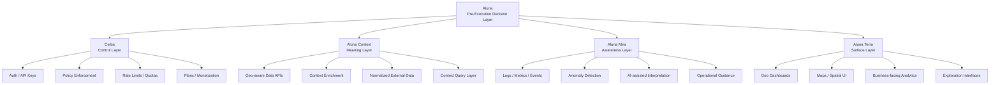

# Diagram 1 — Ontology, product, and infrastructure mapping

```mermaid
flowchart TD
    A["Aluna<br/>Pre-Execution Decision Layer"] --> B["Ceiba<br/>Control Layer"]
    A --> C["Aluna Context<br/>Meaning Layer"]
    A --> D["Aluna Mira<br/>Awareness Layer"]
    A --> E["Aluna Terra<br/>Surface Layer"]

    B --> B1["Auth / API Keys"]
    B --> B2["Policy Enforcement"]
    B --> B3["Rate Limits / Quotas"]
    B --> B4["Plans / Monetization"]

    C --> C1["Geo-aware Data APIs"]
    C --> C2["Context Enrichment"]
    C --> C3["Normalized External Data"]
    C --> C4["Context Query Layer"]

    D --> D1["Logs / Metrics / Events"]
    D --> D2["Anomaly Detection"]
    D --> D3["AI-assisted Interpretation"]
    D --> D4["Operational Guidance"]

    E --> E1["Geo Dashboards"]
    E --> E2["Maps / Spatial UI"]
    E --> E3["Business-facing Analytics"]
    E --> E4["Exploration Interfaces"]
```
