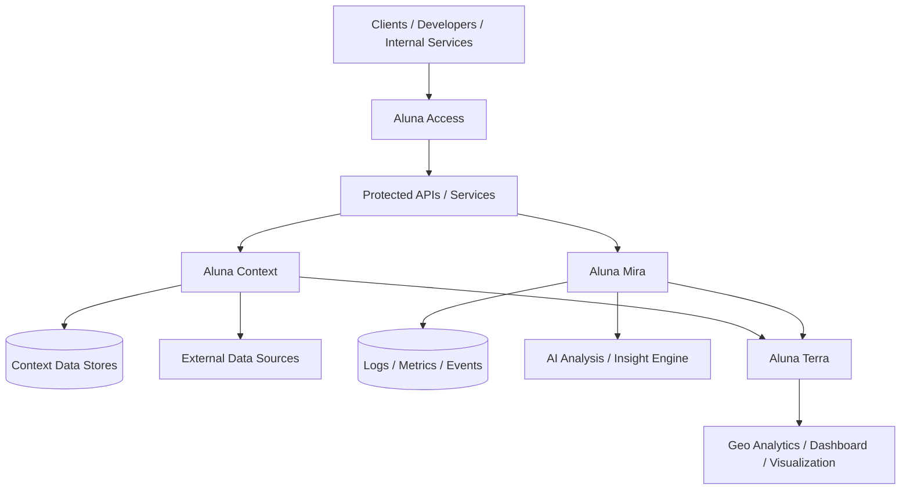

# Diagram 2 — Platform layering

```mermaid
flowchart TB
    U["Clients / Developers / Internal Services"]

    U --> G["Aluna Access"]
    G --> X["Protected APIs / Services"]

    X --> C["Aluna Context"]
    C --> DS[("Context Data Stores")]
    C --> EX["External Data Sources"]

    X --> M["Aluna Mira"]
    M --> OBS[("Logs / Metrics / Events")]
    M --> AI["AI Analysis / Insight Engine"]

    C --> T["Aluna Terra"]
    M --> T
    T --> UI["Geo Analytics / Dashboard / Visualization"]
```
