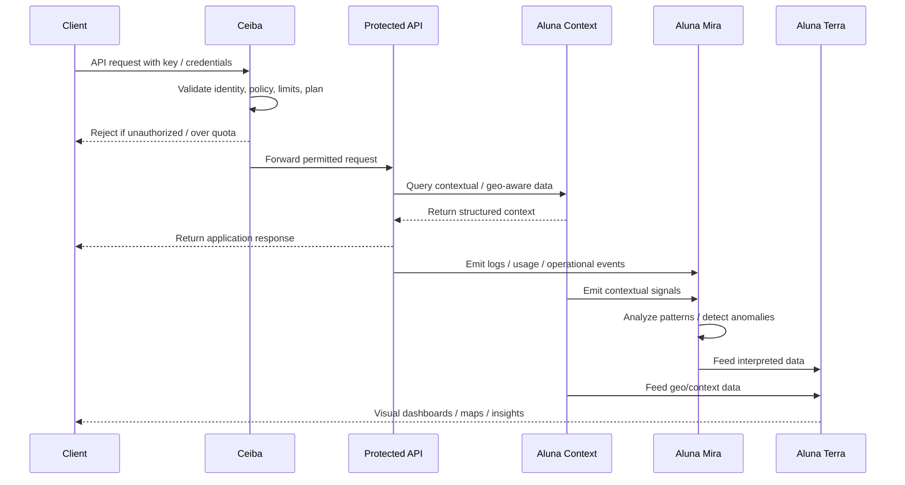

# Diagram 3 — Request lifecycle

```mermaid
sequenceDiagram
    participant Client
    participant Ceiba as Ceiba
    participant API as Protected API
    participant Context as Aluna Context
    participant Mira as Aluna Mira
    participant Terra as Aluna Terra

    Client->>Ceiba: API request with key / credentials
    Ceiba->>Ceiba: Validate identity, policy, limits, plan
    Ceiba-->>Client: Reject if unauthorized / over quota
    Ceiba->>API: Forward permitted request

    API->>Context: Query contextual / geo-aware data
    Context-->>API: Return structured context

    API-->>Client: Return application response

    API->>Mira: Emit logs / usage / operational events
    Context->>Mira: Emit contextual signals
    Mira->>Mira: Analyze patterns / detect anomalies

    Mira->>Terra: Feed interpreted data
    Context->>Terra: Feed geo/context data
    Terra-->>Client: Visual dashboards / maps / insights
```
