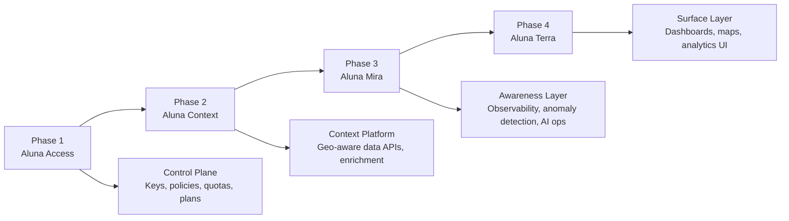

# Diagram 4 — Product evolution

```mermaid
flowchart LR
    A1["Phase 1<br/>Aluna Access"] --> A2["Phase 2<br/>Aluna Context"]
    A2 --> A3["Phase 3<br/>Aluna Mira"]
    A3 --> A4["Phase 4<br/>Aluna Terra"]

    A1 --> I1["Control Plane<br/>Keys, policies, quotas, plans"]
    A2 --> I2["Context Platform<br/>Geo-aware data APIs, enrichment"]
    A3 --> I3["Awareness Layer<br/>Observability, anomaly detection, AI ops"]
    A4 --> I4["Surface Layer<br/>Dashboards, maps, analytics UI"]
```
