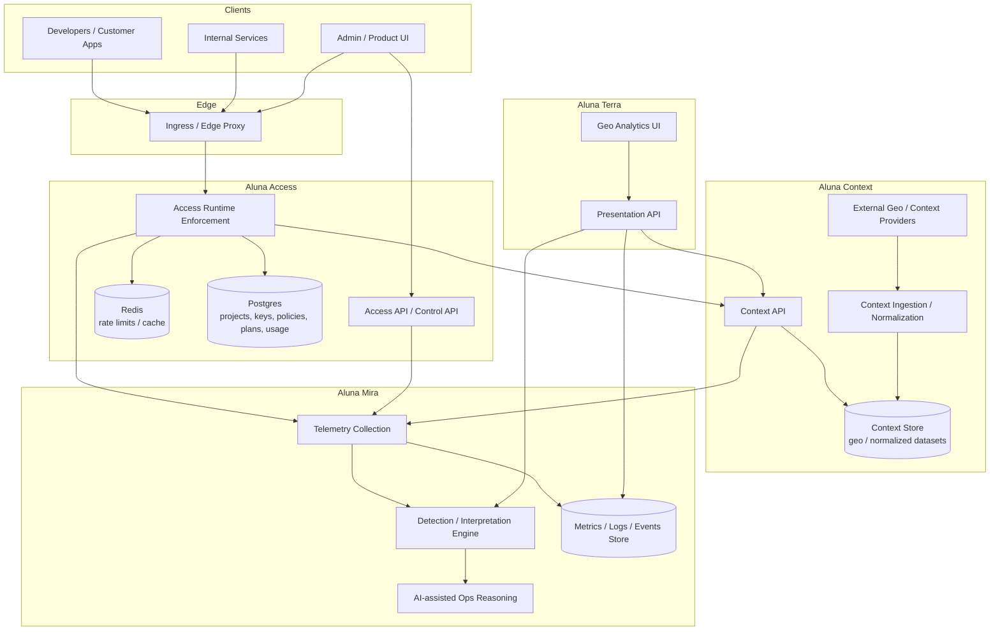

# Diagram 5 — Runtime / infrastructure architecture

```mermaid
flowchart TB
    subgraph Clients["Clients"]
        DEV["Developers / Customer Apps"]
        INT["Internal Services"]
        UI["Admin / Product UI"]
    end

    subgraph Edge["Edge"]
        LB["Ingress / Edge Proxy"]
    end

    subgraph ControlPlane["Aluna Access"]
        ACC_API["Access API / Control API"]
        ACC_RT["Access Runtime Enforcement"]
        ACC_REDIS[("Redis<br/>rate limits / cache")]
        ACC_DB[("Postgres<br/>projects, keys, policies, plans, usage")]
    end

    subgraph ContextPlane["Aluna Context"]
        CTX_API["Context API"]
        CTX_PIPE["Context Ingestion / Normalization"]
        CTX_DB[("Context Store<br/>geo / normalized datasets")]
        EXT["External Geo / Context Providers"]
    end

    subgraph AwarenessPlane["Aluna Mira"]
        MIRA_COL["Telemetry Collection"]
        MIRA_PROC["Detection / Interpretation Engine"]
        MIRA_AI["AI-assisted Ops Reasoning"]
        OBS[("Metrics / Logs / Events Store")]
    end

    subgraph SurfacePlane["Aluna Terra"]
        TERRA_UI["Geo Analytics UI"]
        TERRA_API["Presentation API"]
    end

    DEV --> LB
    INT --> LB
    UI --> LB

    LB --> ACC_RT
    UI --> ACC_API

    ACC_RT --> ACC_REDIS
    ACC_RT --> ACC_DB
    ACC_RT --> CTX_API

    CTX_API --> CTX_DB
    CTX_PIPE --> CTX_DB
    EXT --> CTX_PIPE

    ACC_RT --> MIRA_COL
    CTX_API --> MIRA_COL
    ACC_API --> MIRA_COL

    MIRA_COL --> OBS
    MIRA_COL --> MIRA_PROC
    MIRA_PROC --> MIRA_AI

    TERRA_UI --> TERRA_API
    TERRA_API --> CTX_API
    TERRA_API --> MIRA_PROC
    TERRA_API --> OBS
```
