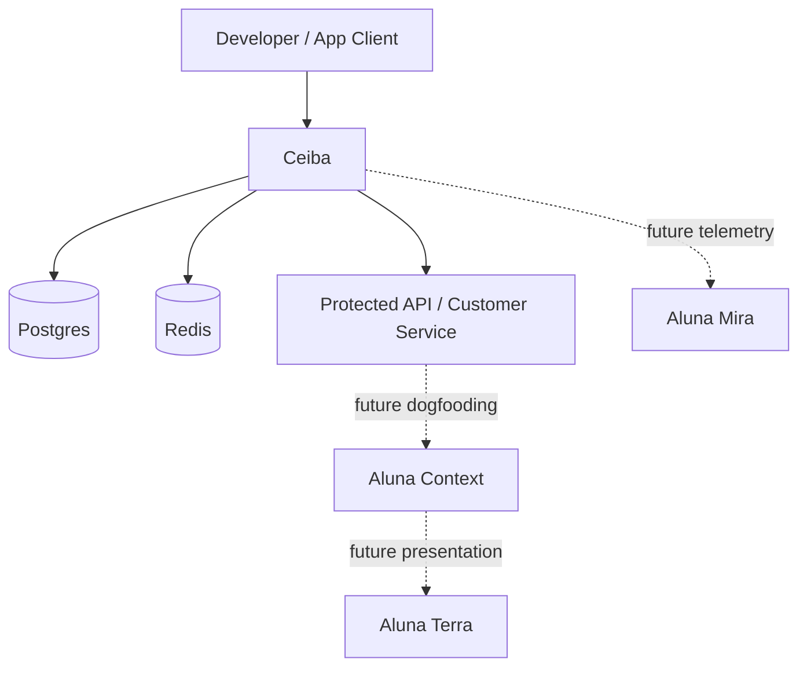

# Diagram 7 — Minimal MVP architecture

```mermaid
flowchart TB
    Client["Developer / App Client"] --> Ceiba["Ceiba"]

    Ceiba --> AccessDB[("Postgres")]
    Ceiba --> Redis[("Redis")]

    Ceiba --> ProtectedAPI["Protected API / Customer Service"]

    ProtectedAPI -.->|"future dogfooding"| Context["Aluna Context"]
    Ceiba -.->|"future telemetry"| Mira["Aluna Mira"]
    Context -.->|"future presentation"| Terra["Aluna Terra"]
```

Dotted lines: phased rollout per [platform ontology](../platform-ontology.md) and [04-product-evolution.md](04-product-evolution.md).
