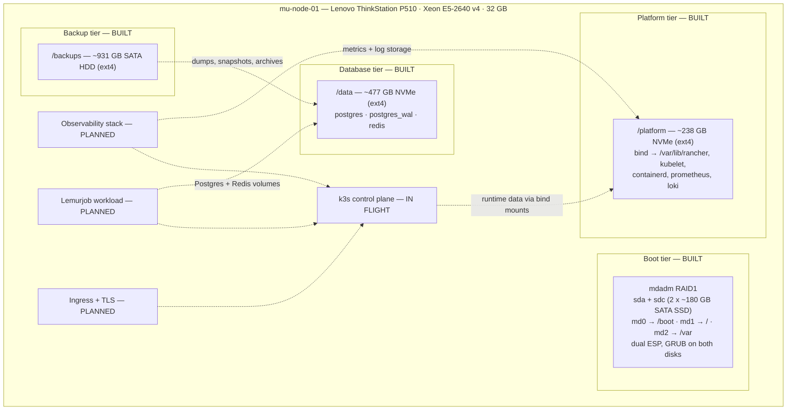
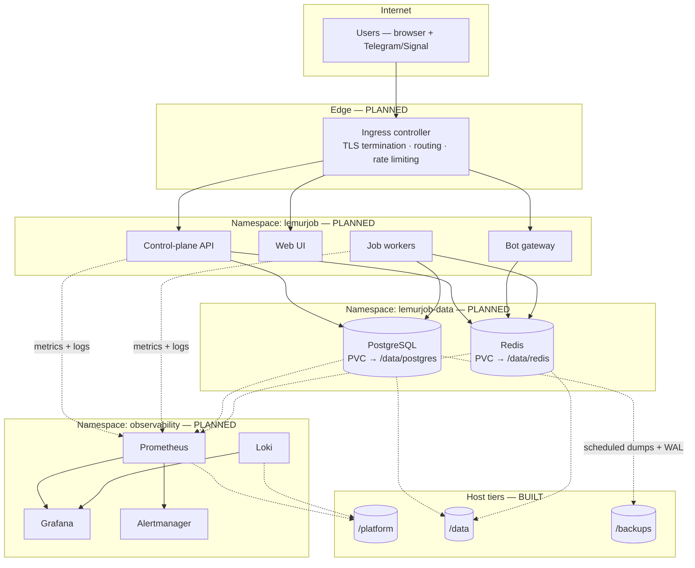

# Platform architecture

**Status:** storage and OS layers **built**; Kubernetes **in flight**; everything above it **planned**.

This is the architectural record for **mu-platform**, a single-node homelab platform designed to run one real workload ([Lemurjob](workload-lemurjob.md)) under production-shaped operational discipline.

---

## 1. Design intent

A single host is not a production cluster. It can, however, be *built like one* — and the useful part of the exercise is doing the separation work that a real cluster forces on you:

| Production concern | How it is expressed on one node |
|--------------------|----------------------------------|
| Failure-domain isolation | One physical device per tier: OS, platform runtime, database, backup |
| Blast-radius control | Mount boundaries; a full or failed tier does not take the others with it |
| IO contention | Write-heavy observability and container churn kept off the database device |
| Recoverability | Dedicated backup tier, restore treated as a rehearsed procedure |
| Observability-first | Metrics, logs, and alerts land before workloads, not after an incident |
| Config as truth | Layout, decisions, and runbooks live in Git, not in shell history |

The build order is deliberate and gated: **infrastructure → observability → deployment discipline → workload**. No application work begins before the platform capability it depends on is accepted.

---

## 2. Current state

**Built and verified:** Ubuntu Server on an mdadm RAID1 boot mirror with a duplicated ESP, and all four storage tiers mounted at boot by UUID with `nofail`, including five bind mounts that keep container-runtime and observability churn off the boot RAID. See [storage.md](storage.md).

**In flight:** single-node k3s bootstrap — runtime paths validated against the existing bind mounts, baseline namespaces, and a PVC smoke test. See [kubernetes.md](kubernetes.md).

**Not yet deployed:** observability stack, ingress controller and TLS, CI/CD pipeline, backup automation, and the Lemurjob workload itself.

---

## 3. Layers

| Layer | Responsibility | Implementation | Status |
|-------|----------------|----------------|--------|
| Hardware / OS | Boot resilience, headless access | Ubuntu Server LTS, mdadm RAID1, SSH-only | Built |
| Storage | Tier separation, persistence, capacity | ext4, UUID `fstab`, bind mounts | Built |
| Container platform | Scheduling, networking, volumes | k3s single node, `local-path` | In flight |
| Observability | Metrics, logs, alerting | Prometheus, Grafana, Loki, Alertmanager | Planned |
| Edge | Public HTTPS entry, TLS termination, routing | Ingress controller + ACME certificates | Planned |
| Delivery | Build, publish, deploy | Git-driven pipeline → registry → cluster | Planned |
| Workload | The service being operated | Lemurjob — API, control plane, workers, bot | Planned |

Each layer is only allowed to exist once the one below it is verified. That constraint is the project.

---

## 4. Target runtime topology

Where the platform is going once k3s, ingress, and observability land:

---

## 5. Trust and operational boundaries

| Boundary | Rule |
|----------|------|
| Public edge | Only the ingress controller is reachable from the internet. The Kubernetes API server is never publicly exposed. |
| Namespace isolation | Application, data, and observability workloads are separated by namespace; network policy tightens this in the hardening phase. |
| Data plane | PostgreSQL and Redis are `ClusterIP` only — no ingress, no `NodePort`. |
| Secrets | Kubernetes secrets, sourced outside the repo. No credentials, keys, or `.env` files are ever committed. |
| Storage | Tier mounts use `nofail`, so a missing disk degrades the node rather than blocking boot. That trade-off requires mount-level alerting, which lands with the observability phase. |
| Backups | Written to a physically separate device from the data they protect; off-host replication is a tracked follow-up. |

---

## 6. Deliberate trade-offs

Single-node homelab, honestly stated:

- **No HA.** One control plane, one node. Node loss is downtime; recovery is restore-from-backup, and the restore path is what gets rehearsed instead.
- **`nofail` on tier mounts.** Prevents a missing disk from wedging boot, at the cost of services potentially starting without their data. Mitigated by mount alerting, not by removing the flag.
- **RAID1 on the boot tier only.** Data and platform tiers are single devices; their resilience story is backups plus restore drills, not mirroring.
- **WAL isolated logically, not physically.** `/data/postgres_wal` is a separate mountpoint on the same NVMe. It enforces the discipline now and makes a future physical split a config change instead of a migration.
- **ext4 everywhere.** Chosen over ZFS for operational simplicity. Snapshot and rollback ergonomics are traded away deliberately; revisit if snapshot discipline becomes the priority.

---

## 7. References

- Storage design and as-built layout: [storage.md](storage.md)
- Kubernetes topology: [kubernetes.md](kubernetes.md)
- Observability design: [observability.md](observability.md)
- Backup and recovery: [backups.md](backups.md)
- Delivery pipeline: [cicd.md](cicd.md)
- Workload requirements: [workload-lemurjob.md](workload-lemurjob.md)
- Diagram sources: [diagrams/](diagrams/README.md)
