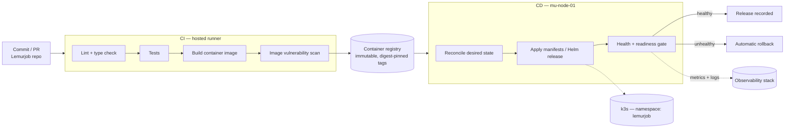

# CI/CD — commit to cluster

**Status: PLANNED.** No pipeline exists yet. It's designed here so the delivery path ends up being a decision rather than an accident, and it lands with the deployment-discipline phase, after Kubernetes and observability but before the workload goes live.

---

## 1. The goal

Get a Lemurjob commit onto the cluster **without anyone running `kubectl apply` from a laptop**.

That constraint drives everything below. Manual deploys are how environments drift and how "what version is actually running?" stops having an answer. On a one-person homelab it's tempting to skip, which is exactly why it's worth building here, where getting it wrong costs a weekend instead of a customer.

---

## 2. Pipeline shape

---

## 3. Stages

| Stage | Runs | Gate |
|-------|------|------|
| Lint / type check | Every push | Must pass |
| Tests | Every push | Must pass |
| Image build | On merge to main | Tagged with commit SHA — never `latest` |
| Vulnerability scan | On image build | Critical CVEs block promotion |
| Deploy | After successful build | Automatic to the single environment |
| Health gate | Post-deploy | Readiness + smoke probe; failure triggers rollback |

**Image tags are immutable and digest-pinned.** `latest` makes "what's running right now?" unanswerable and turns rollback into a coin flip. Every deployed image traces back to exactly one commit.

---

## 4. CI: hosted runner

CI runs on a hosted runner rather than on the node.

| Reason | Detail |
|--------|--------|
| Resource isolation | Image builds are CPU- and IO-heavy; the node is also the production host |
| Blast radius | A build that fills a disk should not be able to take the cluster with it |
| Trust boundary | The runner needs registry credentials, not cluster admin |

Self-hosting the runner on the node is a possible later optimisation, with resource limits, a dedicated namespace, and a conscious decision to accept the contention.

---

## 5. CD: pull-based reconciliation

The cluster reconciles toward a declared desired state committed to Git, rather than CI holding credentials and pushing into the cluster.

| Property | Why it matters here |
|----------|---------------------|
| No inbound cluster credentials in CI | CI never holds `kubeconfig`; a compromised runner cannot reach the cluster |
| Git is the source of truth | "What is deployed" is answered by reading a repo, not by querying a cluster |
| Drift correction | Manual `kubectl` changes get reconciled away, which is the intent |
| Rollback | Revert the commit and the cluster follows |

This repo holds the manifests and Helm values under `deployments/`. Lemurjob's application source stays in its own repository. The split is intentional, since application changes and deployment changes have different review needs and different failure modes.

---

## 6. Secrets

| Rule | Implementation |
|------|----------------|
| Never in Git — plaintext or otherwise | `.gitignore` covers `secrets/`, `.env`, `*.key`, `*.pem` |
| Never in image layers | Injected at runtime as environment or mounted volumes |
| Never in CI logs | Masked variables; no secret echoed in build output |
| Rotatable without a rebuild | Kubernetes secrets, referenced by name from manifests |

Encrypted-secrets-in-Git (SOPS, sealed-secrets) is the natural next step once there's more than one secret consumer. Deferring it for now rather than adopting it early.

---

## 7. Rollback

Rollback is a designed path, not something improvised mid-incident:

1. **Automatic.** The post-deploy health gate fails and the previous revision is restored with no human in the loop.
2. **Manual, by revision.** `kubectl rollout undo`, or roll the Helm release back.
3. **Manual, by commit.** Revert the deployment commit and reconciliation applies it.
4. **Data-layer rollback.** Schema and data aren't covered by any of the above. Migrations stay backward-compatible for one release so an application rollback doesn't require a database restore.

That last one is what actually bites. Application rollback is cheap. Database rollback means [restore from backup](backups.md) and losing everything since the last one.

---

## 8. Acceptance

The delivery phase is complete when:

1. A commit to Lemurjob's main branch produces a scanned, SHA-tagged image without manual steps.
2. A deployment reaches the cluster without anyone touching `kubectl`.
3. A deliberately broken deploy is caught by the health gate and rolled back automatically.
4. The currently running version is identifiable from Git alone.
5. Deploy events are visible alongside metrics, so a change can be correlated with a regression.

Point 3 is worth breaking a deploy on purpose for. A rollback path that has never rolled anything back isn't one yet.

---

## 9. Deferred

- Staging environment. One node, one environment for now, and I'm accepting that trade-off knowingly.
- Progressive delivery (canary, blue/green), which needs replica headroom this node doesn't have.
- Automated database migration gating.
- Image signing and provenance attestation.
- Preview environments per pull request.
