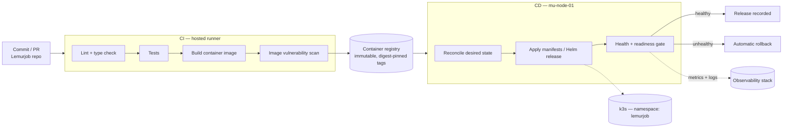

# CI/CD — commit to cluster

**Status: PLANNED.** No pipeline exists yet. It is designed here so the delivery path is a decision rather than an accident, and it lands with the deployment-discipline phase — after Kubernetes and observability, before the workload goes live.

---

## 1. The goal

Get a Lemurjob commit onto the cluster **without a human running `kubectl apply` from a laptop**.

That constraint drives everything below. Manual deploys are the reason environments drift, the reason nobody can say what version is actually running, and the reason rollback becomes an archaeology exercise. On a one-person homelab it is tempting to skip — which is exactly why it is worth building here, where the cost of getting it wrong is a weekend rather than a customer.

---

## 2. Pipeline shape

---

## 3. Stages

| Stage | Runs | Gate |
|-------|------|------|
| Lint / type check | Every push | Must pass |
| Tests | Every push | Must pass |
| Image build | On merge to main | Tagged with commit SHA — never `latest` |
| Vulnerability scan | On image build | Critical CVEs block promotion |
| Deploy | After successful build | Automatic to the single environment |
| Health gate | Post-deploy | Readiness + smoke probe; failure triggers rollback |

**Image tags are immutable and digest-pinned.** `latest` makes "what is running right now?" unanswerable and makes rollback a coin flip. Every deployed image is traceable to exactly one commit.

---

## 4. CI: hosted runner

CI runs on a hosted runner rather than on the node.

| Reason | Detail |
|--------|--------|
| Resource isolation | Image builds are CPU- and IO-heavy; the node is also the production host |
| Blast radius | A build that fills a disk should not be able to take the cluster with it |
| Trust boundary | The runner needs registry credentials, not cluster admin |

Self-hosting the runner on the node is a possible later optimisation — with resource limits, a dedicated namespace, and an explicit decision to accept the contention.

---

## 5. CD: pull-based reconciliation

The cluster reconciles toward a declared desired state committed to Git, rather than CI holding credentials and pushing into the cluster.

| Property | Why it matters here |
|----------|---------------------|
| No inbound cluster credentials in CI | CI never holds `kubeconfig`; a compromised runner cannot reach the cluster |
| Git is the source of truth | "What is deployed" is answered by reading a repo, not by querying a cluster |
| Drift correction | Manual `kubectl` changes get reconciled away — which is the point |
| Rollback | Revert the commit; the cluster follows |

This repo holds the manifests and Helm values under `deployments/`. Lemurjob's application source stays in its own repository. The split is intentional: application changes and deployment changes have different review needs and different failure modes.

---

## 6. Secrets

| Rule | Implementation |
|------|----------------|
| Never in Git — plaintext or otherwise | `.gitignore` covers `secrets/`, `.env`, `*.key`, `*.pem` |
| Never in image layers | Injected at runtime as environment or mounted volumes |
| Never in CI logs | Masked variables; no secret echoed in build output |
| Rotatable without a rebuild | Kubernetes secrets, referenced by name from manifests |

Encrypted-secrets-in-Git (SOPS, sealed-secrets) is the natural next step once there is more than one secret consumer. It is deliberately deferred rather than adopted prematurely.

---

## 7. Rollback

Rollback is a first-class path, not an emergency improvisation:

1. **Automatic** — the post-deploy health gate fails, and the previous revision is restored without a human in the loop.
2. **Manual, by revision** — `kubectl rollout undo`, or roll the Helm release back.
3. **Manual, by commit** — revert the deployment commit; reconciliation applies it.
4. **Data-layer rollback** — schema and data are *not* covered by any of the above. Migrations must be backward-compatible for one release, so an application rollback does not require a database restore.

That last point is the one that actually bites. Application rollback is cheap; database rollback means [restore from backup](backups.md) and losing everything since the last one.

---

## 8. Acceptance

The delivery phase is complete when:

1. A commit to Lemurjob's main branch produces a scanned, SHA-tagged image without manual steps.
2. A deployment reaches the cluster without anyone touching `kubectl`.
3. A deliberately broken deploy is caught by the health gate and rolled back automatically.
4. The currently running version is identifiable from Git alone.
5. Deploy events are visible alongside metrics, so a change can be correlated with a regression.

Point 3 is the one worth testing on purpose. A rollback path that has never rolled anything back is decoration.

---

## 9. Deferred

- Staging environment — one node, one environment for now; the trade-off is accepted and stated.
- Progressive delivery (canary, blue/green) — needs replica headroom this node does not have.
- Automated database migration gating.
- Image signing and provenance attestation.
- Preview environments per pull request.
