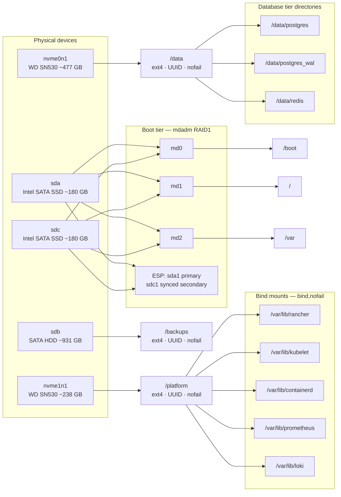

# 01 — Storage tiers

**Reflects the built state of `mu-node-01`.** Narrative: [../storage.md](../storage.md).

**What the diagram is showing:** every high-churn path on the node resolves to `/platform`, and every latency-sensitive path resolves to `/data`. Neither touches the boot RAID.

**Two facts that must not drift:** the *larger* NVMe is the database tier, and the backup device is `sdb`. `sdc` is the second RAID1 boot SSD.
