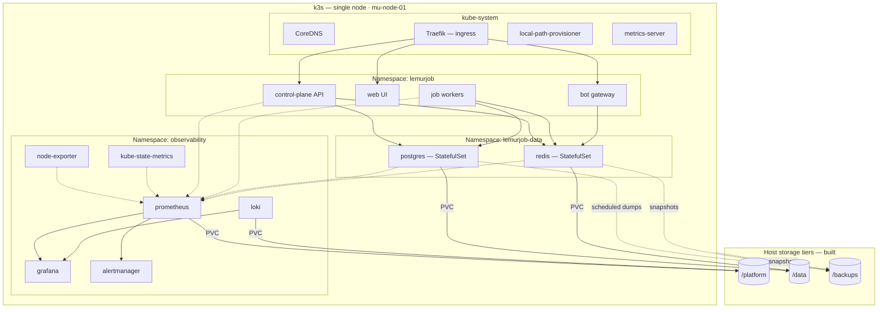

# 02 — Cluster topology

**Target state.** The cluster bootstrap is in flight; workloads are not deployed. Narrative: [../kubernetes.md](../kubernetes.md).

**Three namespaces, three operational profiles:** application workloads that redeploy constantly, stateful services that shouldn't be casually restarted, and a monitoring stack that has to keep working while the other two are broken.

**Storage routing is the detail doing the most work here.** Postgres and Redis PVCs resolve to the database tier, Prometheus and Loki to the platform tier. Neither competes with the other for IO, which is why those are separate devices.

**Data services are `ClusterIP` only.** Nothing in `lemurjob-data` is reachable from outside the cluster.
