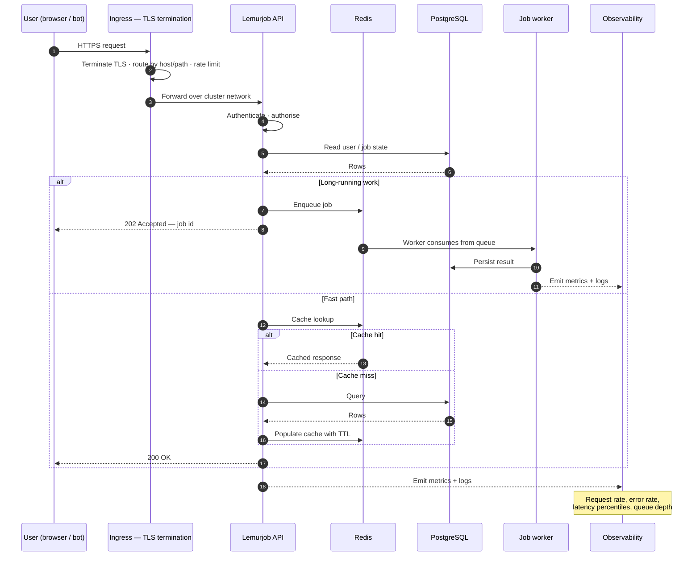

# 03 — Request path

**Target state.** Ingress, TLS, and the workload are not yet deployed. Narrative: [../architecture.md](../architecture.md).

**Design rules visible in the flow:**

- **TLS terminates at the edge.** Only the ingress controller is reachable from the internet; the Kubernetes API server never is.
- **Long work is asynchronous.** Job processing never blocks an HTTP response, so the API stays fast and predictable while workers do the expensive part.
- **Every path is observed.** Request-level signals and queue depth are emitted by default rather than added after the first incident.
- **Data services are internal.** PostgreSQL and Redis are only reachable from inside the cluster.
