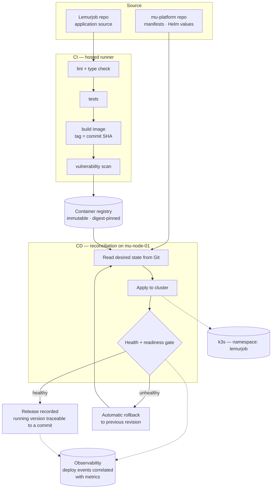

# 04 — Delivery pipeline

**Target state.** No pipeline is built yet. Narrative: [../cicd.md](../cicd.md).

**Why it is shaped this way:**

- **Pull-based CD.** The cluster reconciles toward Git; CI never holds a `kubeconfig`. A compromised runner cannot reach the cluster.
- **Split repos.** Application source and deployment state live apart, since they have different review needs and different failure modes.
- **No `latest`.** Every image is tagged with a commit SHA, so "what's running?" has exactly one answer.
- **Rollback is a designed path**, exercised on purpose rather than improvised during an incident.
- **Deploys are observable.** Release events land next to metrics, so a regression can be traced to the change that caused it.

**Not covered by rollback:** database schema and data. Migrations stay backward-compatible for one release so an application rollback never requires a [restore](../backups.md).
